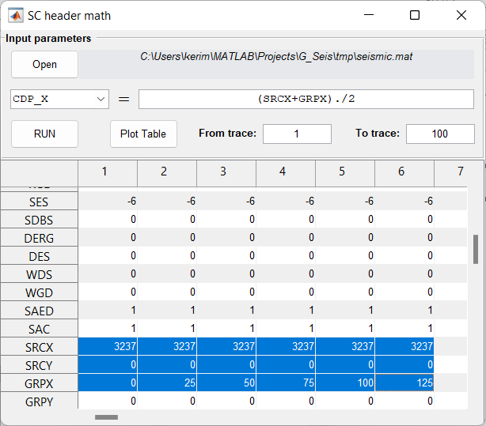

Header Math
===========

This module is dedicated to trace header calculations.

Use ComboBox to choose trace header that should be edited.

In LineEdit type a mathematical function using Matlab syntax for vectors.

Select **From trace** and **To trace** LineEdits before displaying values in the table.

Examples:

#. compute **CDP_X**: *(SRCX+GRPX)./2*
#. make **DSREG** (offsets) absolute: *abs(DSREG)*