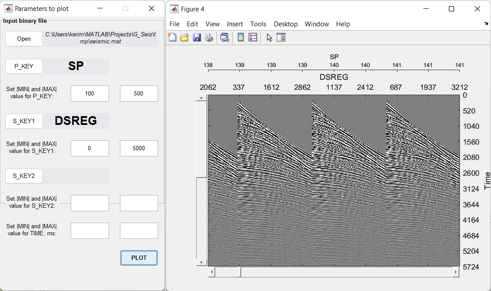

Plot Data
=========

Plotting is for traces and computed factors visualization.

**P_KEY** - is primary key.

**S_KEY1** and **S_KEY2** - secondary keys.

Keys are needed to sort data before displaying.

Absolute values of **MIN** and **MAX** values are helpful to restrict the desired data.

In case of displaying factors only **P_KEY** is used wich should be set to **SEQWL**. 

To display **S** (shot) factor for first layer choose **MIN** and **MAX** equal to 1. 
For the second layer use 11.
For the third layer use 21.

To display **R** (receiver) factor for first layer choose **MIN** and **MAX** equal to 2. 
For the second layer use 12.
For the third layer use 22.

To display **M** (offset) factor for first layer choose **MIN** and **MAX** equal to 3. 
For the second layer use 13.
For the third layer use 23.

To display **G** (cdp) factor for first layer choose **MIN** and **MAX** equal to 4. 
For the second layer use 14.
For the third layer use 24.

.. note::
   Use :doc:`header_math` module to view headers of computed factors.