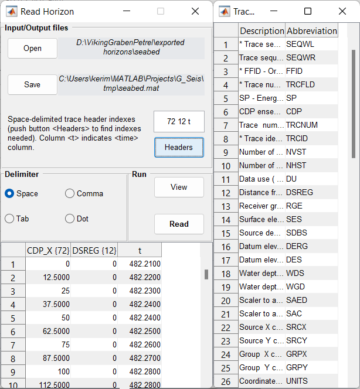

Read Horizon
============

Horizon reader translates textual column oriented files to Matlab's *.mat*-files.

Horizon files may be used when selecting areas for computing factors.

Use LineEdit widget to set trace header index for each column.
For **Z** values use letter **t**.

.. note::
   Use **View** button before reading.