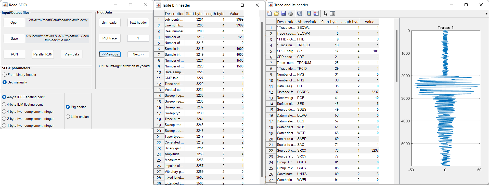

Read SEGY
=========

SEGY reader translates SEGY files to **G_Seis** internal format:
binary header is presented as Matlab's *.mat*-file and traces along with 
trace headers are in *.bin*-file of type **float32**.

.. note::
   Use **View  data** to check if SEGY parameters are correct.