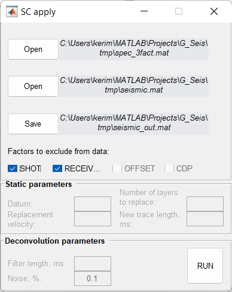

SC Apply
========

Exclude computed factors (amplitude or static shifts) from the data.

.. note::
   Factors file is a *.mat*-file computed with :doc:`sc_decomposition` or :doc:`sc_time_decomposition`