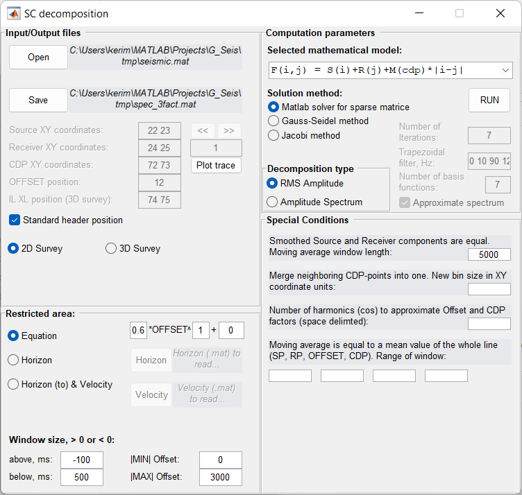

SC Decomposition
================

Solves system of linear equations to decompose amplitudes or spectrums by factors.
Computed factors then used by :doc:`sc_apply` module 
to apply amplitude correction or deconvolution.

