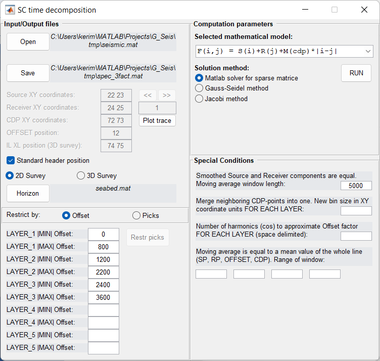

SC Time Decomposition
=====================

Solves system of linear equations to decompose timefield by factors.
Computed S (source) and R (receiver) factors then used by :doc:`sc_apply` module 
to apply static shifts and by :doc:`sc_build_vel_model` to perform interactive corrections.

Choose horizon with first break picks.

Set the limits by offsets or by picks for each layer.

There are two mathematical models: 

#. F(i,j) = S(i)+R(j)+M(cdp)*|i-j| for refracted waves
#. F(i,j) = S(i)+R(j)+M(cdp)*|i-j|^2 for relfected waves

In **Special Conditions** section set the parameters to regularize the solution.

For more information see:

*Taner T.M., Wagner D.E., Baysal E., Lu L. A unified method for 2-D and 3-D
refraction statics // Geophysics, 1998, vol. 63 (1), pp. 260-274.*