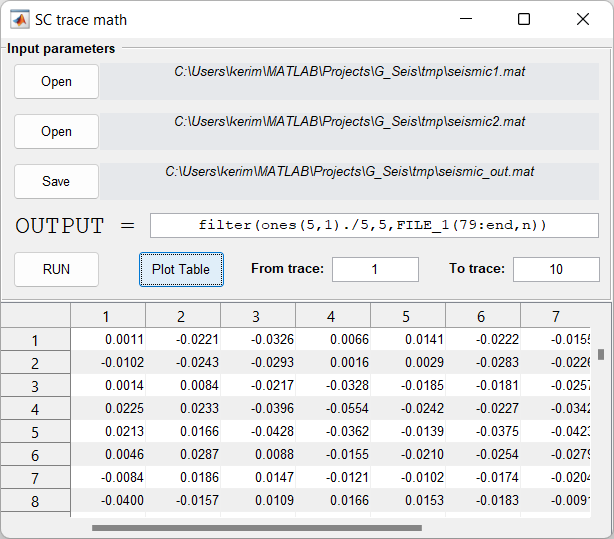

Trace Math
==========

This module is dedicated to trace calculations.

In LineEdit type a mathematical function using Matlab syntax for column-vector.

Variables **FILE_1** and **FILE_2** may be used to perform caomputations on selected datasets.

Examples:

#. sum each trace from **FILE_1** with **FILE_2**: *FILE_1(79:end,n)+FILE_2(79:end,n)*
#. filter **FILE_1** with moving average filter: *filter(ones(5,1)./5,5,FILE_1(79:end,n))*

.. note::
   **78** is the number of trace headers (they are skipped when computation starts with **79** index). **n** is the iterator used in loop by traces.

.. note::
   **FILE_1** and **FILE_2** must have the same number of samples and traces.