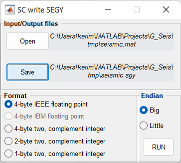

Write SEGY
==========

SEGY writer translates **G_Seis** internal format to SEGY.

.. note::
   **IBM32** is known only in seismic exploration. Translation it to **IEEE32** is pretty painful: that is why there is no support for writing it.